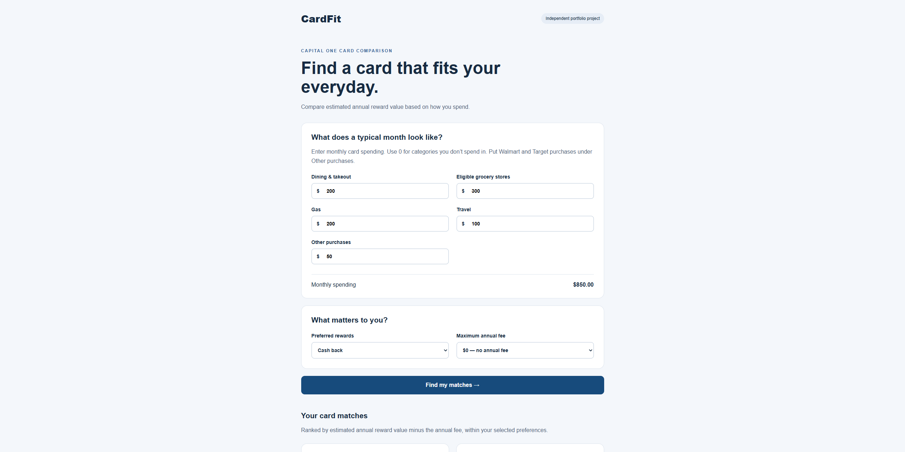
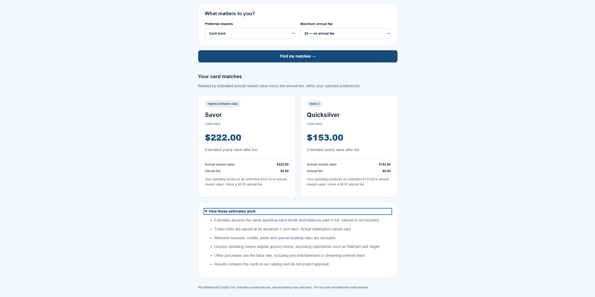

# CapOneCardFit

A full-stack web application that compares Capital One credit cards
using monthly spending, reward preferences, and an annual fee budget.

The app estimates annual reward value, subtracts annual fees, and
explains the resulting rankings.

Independent portfolio project. Not affiliated with or endorsed by
Capital One.

## Screenshots

### Spending quiz


### Personalized results


## Features

- Monthly spending inputs for dining, groceries, gas, travel, and other purchases.
- Filters for cash back, travel miles, and maximum annual fee.
- Ranked results with annual reward estimates and fee breakdowns.
- Card data stored in PostgreSQL.
- Server-side input validation.
- Responsive React interface with loading and error states.
- Docker Compose setup for local development.

## Technology

| Layer | Technology |
|---|---|
| Frontend | React, TypeScript, Vite, CSS |
| Backend | Java 21, Spring Boot, Spring Web MVC |
| Database | PostgreSQL 17, Spring Data JPA |
| Tests | JUnit Jupiter, Mockito |
| Development environment | Docker, Docker Compose |

## How it works

1. React collects spending amounts and preferences.
2. The frontend sends a POST request to `/api/recommendations`.
3. Spring Boot validates the request and reads cards from PostgreSQL.
4. Cards are filtered by reward preference and annual fee limit.
5. The backend calculates annual reward value minus annual fees.
6. Results are sorted by net annual value and displayed in React.

Calculations use BigDecimal and round annual reward values to
two decimal places.

## Run locally

Install Docker Desktop, or Docker Engine with Docker Compose.
Docker must be running with Linux container support.

Clone this repository and open a terminal in its root folder.

```bash
docker compose up --build -d
```

Open:

- App: http://localhost:5173
- Backend health check: http://localhost:8080/api/health

The first build downloads dependencies and may take several minutes.

The database is seeded with four cards on backend startup.
Existing card records are preserved.

### View logs

```bash
docker compose logs --tail=100 backend frontend
```

### Stop the app

```bash
docker compose down
```

The PostgreSQL named volume preserves data when containers are removed.

### Apply code changes

```bash
docker compose up --build -d
```

The current setup copies source files into Docker images.
Rebuild the affected service after editing its source.

## Run calculation tests

These unit tests use a mocked repository and do not require PostgreSQL.

From the repository root in Windows PowerShell:

```powershell
docker run --rm --mount "type=bind,source=$($PWD.Path)/backend,target=/app" -w /app maven:3.9-eclipse-temurin-21 mvn -Dtest=RecommendationControllerTests test
```

From the repository root in macOS/Linux:

```bash
docker run --rm --mount "type=bind,source=$(pwd)/backend,target=/app" -w /app maven:3.9-eclipse-temurin-21 mvn -Dtest=RecommendationControllerTests test
```

Coverage includes:

- Cashback calculations and ranking.
- Annual fee filtering, including the exact fee boundary.
- Ranking across both reward types.
- Zero spending and negative net value after fees.
- An empty card catalog.

These tests do not cover HTTP validation, database integration,
or browser interactions.

## Example API request

`POST /api/recommendations`

```json
{
  "spending": {
    "dining": 300,
    "groceries": 500,
    "gas": 200,
    "travel": 100,
    "other": 400
  },
  "rewardPreference": "cashback",
  "maxAnnualFee": 0
}
```

With the initial card data, this returns:

| Card | Estimated annual value after fee |
|---|---:|
| Savor | $372.00 |
| Quicksilver | $270.00 |

## Assumptions and limitations

- Compares four seeded cards, not the complete Capital One catalog.
- Assumes spending stays constant throughout the year.
- Assumes balances are paid in full; interest is excluded.
- Values travel miles at an assumed $0.01 each.
- Excludes welcome bonuses, credits, perks, and special booking rates.
- Eligible grocery spending excludes superstores such as Walmart and Target.
- Other purchases receive the base rate; entertainment and streaming
  bonus categories are not modeled separately.
- Card data is manually maintained and does not update automatically.
- Recommendations do not predict approval or assess creditworthiness.
- The Compose credentials and Vite development server are intended
  for local development, not a production deployment.

## Card information

Verify current terms with the issuer:

- [Savor](https://www.capitalone.com/credit-cards/savor/)
- [Quicksilver](https://www.capitalone.com/credit-cards/quicksilver/)
- [VentureOne](https://www.capitalone.com/credit-cards/ventureone/)
- [Venture](https://www.capitalone.com/credit-cards/venture/)